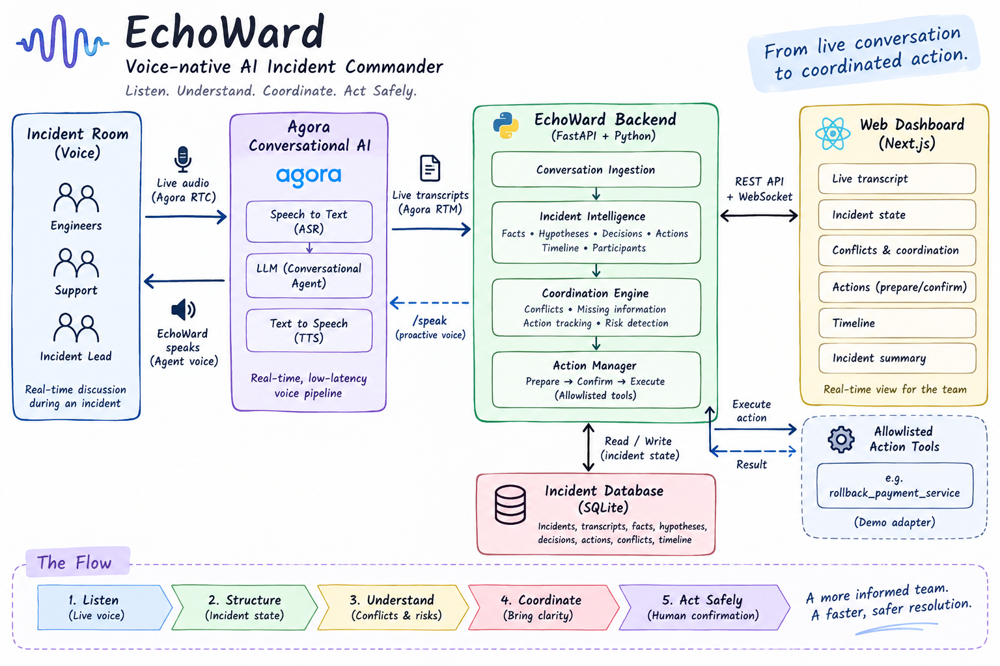
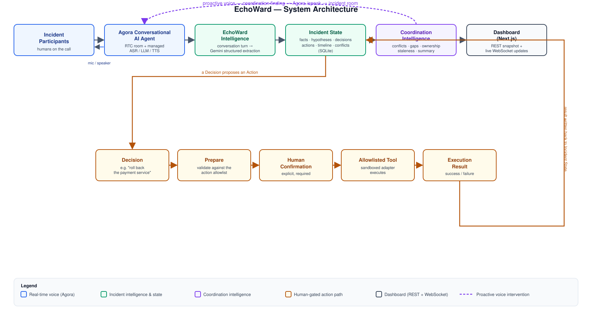

# EchoWard

**Voice-native AI Incident Commander** — built for the EchoSphere: Agora Conversational AI
Hackathon 2026 (PS41).

**Live Demo:** https://echo-ward.vercel.app/

[Architecture](ARCHITECTURE.md) · [Problem Statement](docs/PROBLEM_STATEMENT.md) ·
[Agora Integration](docs/AGORA.md) · [Demo Runbook](docs/DEMO.md)

## What is EchoWard?

EchoWard joins a live technical incident room as an AI operational teammate. It listens to the
conversation happening on the call, continuously maintains a shared incident state — facts,
hypotheses, decisions, actions, owners, and a timeline — and surfaces conflicts and missing
information instead of guessing at root cause. On top of that shared picture, a coordination layer
flags what the team needs to pay attention to *next*: unresolved conflicts, unowned or stale
actions, decisions with no tracked follow-up, hypotheses being acted on as if confirmed, and open
risks. EchoWard can speak up on its own when something needs attention, and — with an explicit
human confirmation — can execute a small set of pre-approved operational actions.

> **It doesn't pretend to know what's true. It helps the team establish what's known, what's
> uncertain, what's decided, and what needs to happen next.**

## Problem

Live incident calls are coordinated entirely by voice, in real time, with no one dedicated to
keeping a clean shared record. In practice that produces the same failure modes every time:

- **Fragmented live communication** — the only record of what was said is memory or a chat
  scrollback.
- **Facts mixed with hypotheses** — a confidently-worded guess and a verified observation get
  repeated back interchangeably within minutes.
- **Conflicting information** — two people report different things and the group either stalls
  arguing about it or one report silently gets dropped.
- **Forgotten decisions** — a decision is made out loud and never turned into a tracked, owned
  action.
- **Unclear ownership** — actions exist only as spoken commitments, with no durable record of who
  owns what.
- **Manual coordination overhead** — someone has to fight the fire *and* play scribe/coordinator at
  the same time.

This is exactly the challenge in **PS41: Voice AI Incident Commander** — build a voice-native AI
that joins the live conversation, maintains a structured shared picture of the incident, and only
ever acts with explicit human confirmation. See [docs/PROBLEM_STATEMENT.md](docs/PROBLEM_STATEMENT.md)
for the full requirement-to-implementation mapping.

## Technical Architecture



To read in detail checkout [ARCHITECTURE.md](ARCHITECTURE.md)

## Core workflow

```
LISTEN  →  STRUCTURE  →  UNDERSTAND  →  COORDINATE  →  ACT SAFELY
```

- **Listen** — EchoWard joins the Agora RTC room as a participant and hears the live conversation.
- **Structure** — each conversation turn is turned into structured facts, hypotheses, decisions,
  actions, and timeline events.
- **Understand** — contradictions between statements are detected and recorded as conflicts, not
  silently resolved.
- **Coordinate** — a dedicated layer reasons over that structured state to surface unowned/stale
  actions, decisions without follow-through, and other coordination gaps.
- **Act safely** — a proposed operational action only ever executes after an explicit human
  confirmation, through an allowlisted, sandboxed tool adapter.

## Key capabilities

- Real-time Agora voice participation (join, listen, speak) in the incident room
- Live transcript ingestion over Agora's RTM signaling channel
- Structured facts / hypotheses / decisions / actions, each carrying an explicit confidence/status
- Persisted incident timeline
- Conflict detection, including a deterministic hypothesis-vs-fact contradiction backstop
- Missing-information / coordination findings (unowned actions, stale actions, decisions without
  follow-up, hypothesis-as-fact risk, unresolved questions, a situational summary)
- Proactive spoken interventions — EchoWard can speak up on its own when something needs attention
- Human conflict resolution — an explicit action, never automatic
- Human-confirmed action execution — Prepare → Confirm → Execute
- Execution results fed back into incident state, visible on the dashboard and spoken aloud
- Incident status lifecycle and an on-demand spoken status summary

## Why it is different

- **The conversation itself becomes incident state** — not a transcript to read later, but a live,
  structured model the team and EchoWard share while the incident is still happening.
- **Uncertainty is surfaced, not hidden** — every fact carries a confidence field, every hypothesis
  a status, and contradictions are recorded rather than resolved for you.
- **EchoWard does not arbitrarily choose a root cause** — there is no `root_cause` field anywhere in
  the data model; a suspected cause is just a hypothesis like any other.
- **Critical actions are human-gated** — a fixed allowlist and an explicit confirmation step stand
  between any proposal and anything actually happening.

## Agora

Agora Conversational AI is EchoWard's real-time voice foundation, not a cosmetic layer:

- The **EchoWard Conversational AI agent** joins the Agora RTC room as a participant, using a
  managed **ASR → LLM → TTS pipeline** published in Agora's Agent Builder — EchoWard's backend
  never proxies or inspects raw audio.
- Live human speech reaches incident intelligence via Agora's **RTM transcript stream**, parsed on
  the frontend and submitted to EchoWard's conversation endpoint.
- EchoWard can speak **proactively** — not just respond — by calling the agent's Agora `/speak`
  endpoint when a conflict, an action awaiting confirmation, or a missing-information gap needs
  attention.

The Agora voice layer and EchoWard's own intelligence layer (Gemini-backed structured extraction
and coordination reasoning) are intentionally separate integrations with distinct responsibilities.
Full detail in [docs/AGORA.md](docs/AGORA.md).

## Architecture



See [ARCHITECTURE.md](ARCHITECTURE.md) for the full system design, including the coordination
layer and the human-controlled action path.

## Safety

Operational actions follow an explicit **Prepare → Confirm → Execute** lifecycle. A proposed action
is validated against a fixed allowlist when prepared, and again immediately before execution; the
only code path that actually calls a tool adapter is an explicit confirmation request, which
independently re-checks the action's persisted state rather than trusting a prior check or inferred
conversational intent. The current tool adapter is a deterministic sandbox — no real system is
touched — so the full prepare/confirm/execute/result path is real and demonstrable without an
external integration. See [docs/decisions/003-human-gated-actions.md](docs/decisions/003-human-gated-actions.md).

## Demo scenario

The scripted walkthrough: **503 errors → hypothesis → contradictory database evidence → conflict →
human resolution → rollback decision → prepare → confirmation → execution → result → status.** Full
spoken lines and expected dashboard state at each step: [docs/DEMO.md](docs/DEMO.md).

## Tech stack

- **Frontend:** Next.js 16 (App Router) + React 19 + TypeScript, Tailwind CSS v4
- **Backend:** Python 3.12 + FastAPI, run with Uvicorn
- **Voice/RTC:** Agora RTC Web SDK NG + Agora Conversational AI Engine (managed ASR/LLM/TTS) +
  Agora RTM SDK (live transcript signaling)
- **Incident intelligence:** Gemini (`google-genai`, structured JSON output)
- **State/database:** SQLite (stdlib `sqlite3`, no ORM)
- **Validation/schema:** Pydantic v2 (`pydantic-settings` for config)
- **Realtime dashboard:** FastAPI WebSocket, in-process fanout
- **Testing:** pytest (backend, 163 tests); frontend via `tsc --noEmit` + ESLint + a Vitest unit
  suite for transcript parsing

## Run locally

### Prerequisites

- Node.js 20+ and npm
- Python 3.12+
- An [Agora](https://console.agora.io) account (free) with a project that has **RTC** and
  **Conversational AI** enabled — required only to run the voice room; the app and its tests run
  without one.
- A [Gemini API key](https://aistudio.google.com/apikey) (free tier) — required only to run
  incident-intelligence extraction; the app and its tests run without one (the conversation
  endpoint returns a clear `503` instead).

### Backend (FastAPI)

```bash
cd backend
python3 -m venv .venv
source .venv/bin/activate        # Windows: .venv\Scripts\activate
pip install -r requirements.txt

cp .env.example .env             # fill in real values as needed

uvicorn app.main:app --reload    # runs on http://localhost:8000
pytest                           # run tests
ruff check .                     # lint
```

### Frontend (Next.js)

```bash
cd frontend
npm install

cp .env.example .env.local       # fill in real values as needed

npm run dev                      # runs on http://localhost:3000
npm run lint
npx tsc --noEmit
npm run build
```

### Configuring Agora

1. Create a project at [console.agora.io](https://console.agora.io) with **App Certificate**
   enabled, and copy the **App ID**/**App Certificate** into `backend/.env`.
2. Generate a **Customer ID**/**Customer Secret** pair (RESTful API section) for the
   Conversational AI Engine, and put them in `backend/.env`.
3. Enable **Conversational AI Engine** for the project, then publish a pipeline in **Agent
   Builder** (ASR/LLM/TTS configured there, using Agora's managed credentials). Copy its
   **pipeline ID** into `backend/.env` as `AGORA_AGENT_PIPELINE_ID`.
4. The frontend needs no Agora env var beyond `NEXT_PUBLIC_API_URL` — it receives `app_id` from the
   backend's token endpoint.

### Configuring incident intelligence (Gemini)

Get a free key at [aistudio.google.com/apikey](https://aistudio.google.com/apikey) and set it as
`GEMINI_API_KEY` in `backend/.env`. This is separate from the Agora voice agent's managed LLM — see
[docs/AGORA.md](docs/AGORA.md).

### Exercising the system without a browser

```bash
# Create an incident
curl -s -X POST http://localhost:8000/api/incidents \
  -H "Content-Type: application/json" -d '{"title": "Payments outage"}'

# Feed it a conversation turn (requires GEMINI_API_KEY)
curl -s -X POST http://localhost:8000/api/incidents/<incident_id>/conversation \
  -H "Content-Type: application/json" \
  -d '{"speaker": "Alice", "text": "Payments are failing for about 30% of users."}'

# Read the current structured state
curl -s http://localhost:8000/api/incidents/<incident_id>/state
```

Automated tests (`pytest`) exercise the full pipeline — intelligence, coordination, realtime
broadcast, and action prepare/confirm/execute — with the LLM and Agora calls mocked, so `pytest`
needs no live `GEMINI_API_KEY` or Agora account.

## Deployment

Backend on [Render](https://render.com) (free-tier web service, via `render.yaml`), frontend on
[Vercel](https://vercel.com) — no Docker, SQLite unchanged. Set `CORS_ORIGINS` on Render to your
Vercel origin, and `NEXT_PUBLIC_API_URL` on Vercel to your Render backend's URL. Render's free tier
has an ephemeral filesystem (the SQLite file resets on redeploy/restart) and spins down after ~15
minutes idle — give it a minute to wake up before a live demo. Full walkthrough in
[ARCHITECTURE.md](ARCHITECTURE.md#deployment).

## Documentation

- [docs/PROBLEM_STATEMENT.md](docs/PROBLEM_STATEMENT.md) — the PS41 problem and requirement mapping
- [ARCHITECTURE.md](ARCHITECTURE.md) — full system architecture
- [docs/AGORA.md](docs/AGORA.md) — the Agora integration in detail
- [docs/DEMO.md](docs/DEMO.md) — the 5-minute demo runbook
- [docs/decisions/](docs/decisions/) — architecture decision records
